# 🏗️ Homie Orchestrator Architecture

> **A deep dive into the engineering marvel that makes your home lab infrastructure bulletproof.**

## 🧠 Design Philosophy

Homie Orchestrator is built on three core principles that make it fundamentally different from other orchestration platforms:

### 🎮 **Consumer-Grade Simplicity**
- **Zero-configuration defaults** - Works out of the box
- **Self-documenting** - The system explains itself
- **Progressive complexity** - Start simple, scale as needed

### 🛡️ **Enterprise-Grade Reliability**  
- **Self-healing by design** - Automatic failure recovery
- **A/B update system** - Zero-downtime deployments
- **Comprehensive monitoring** - Observability without overhead

### ⚡ **Edge-First Architecture**
- **Resource efficient** - Optimized for ARM and low-power devices
- **Offline capable** - Works without internet connectivity
- **AI-first** - Optimized for local AI workloads and inference

---

## 🏗️ System Architecture Overview

```mermaid
graph TB
    subgraph "🎮 User Interfaces"
        UI[Web Dashboard]
        CLI[CLI Tool]
        API[REST API]
        Mobile[Mobile App]
    end
    
    subgraph "🧠 Orchestrator Core"
        Gateway[API Gateway]
        Auth[Authentication]
        Router[Request Router]
    end
    
    subgraph "⚙️ Core Services"
        CM[Container Manager]
        HM[Health Monitor]
        BM[Backup Manager]
        SC[Scheduler]
        MM[Metrics Manager]
        UM[Update Manager]
    end
    
    subgraph "💾 Data Layer"
        DB[(PostgreSQL)]
        Cache[(Redis)]
        Files[File Storage]
    end
    
    subgraph "🐳 Container Runtime"
        Docker[Docker Engine]
        Registry[Container Registry]
        Network[Docker Networks]
        Volumes[Docker Volumes]
    end
    
    subgraph "🔄 External Integration"
        RAUC[RAUC Updates]
        Prometheus[Metrics Export]
        Webhooks[Webhooks]
        Git[Git Integration]
    end
    
    UI --> Gateway
    CLI --> Gateway
    API --> Gateway
    Mobile --> Gateway
    
    Gateway --> Auth
    Auth --> Router
    Router --> CM
    Router --> HM
    Router --> BM
    Router --> SC
    Router --> MM
    Router --> UM
    
    CM --> DB
    CM --> Cache
    CM --> Docker
    
    HM --> Cache
    HM --> Prometheus
    
    BM --> Files
    BM --> DB
    
    SC --> Cache
    SC --> CM
    
    MM --> Prometheus
    MM --> Cache
    
    UM --> RAUC
    UM --> Docker
    UM --> Registry
    
    Docker --> Network
    Docker --> Volumes
```



---

## 🔧 Core Components Deep Dive

### 🎮 API Gateway & Authentication

**Responsibilities:**
- Request routing and load balancing
- Authentication and authorization  
- Rate limiting and DDoS protection
- API versioning and backward compatibility

**Technologies:**
- **FastAPI** - High-performance async Python framework
- **JWT tokens** - Stateless authentication
- **OAuth2** - Third-party authentication support
- **Rate limiting** - Redis-based request throttling

```python
# Example: Authentication middleware
@app.middleware("http")
async def auth_middleware(request: Request, call_next):
    if request.url.path.startswith("/api/"):
        token = request.headers.get("Authorization")
        if not await validate_token(token):
            return JSONResponse(
                status_code=401, 
                content={"error": "Invalid token"}
            )
    return await call_next(request)
```

### 🐳 Container Manager

**The Heart of the System** - Manages the entire container lifecycle with intelligent automation.

**Key Features:**
- **Declarative state management** - Define desired state, system maintains it
- **Dependency resolution** - Automatic startup ordering and health dependencies
- **Resource optimization** - Dynamic resource allocation and scaling
- **Network management** - Automatic service discovery and load balancing

**Architecture:**
```python
class ContainerManager:
    async def deploy_service(self, config: ServiceConfig):
        # 1. Validate configuration
        await self.validator.validate(config)
        
        # 2. Resolve dependencies  
        deps = await self.dependency_resolver.resolve(config.depends_on)
        
        # 3. Create container with optimized settings
        container = await self.docker_client.create_container(
            image=config.image,
            environment=config.environment,
            volumes=self._optimize_volumes(config.volumes),
            networks=self._setup_networks(config.networks),
            resources=self._calculate_resources(config)
        )
        
        # 4. Start container and register for monitoring
        await container.start()
        await self.health_monitor.register(container)
        
        # 5. Update service registry
        await self.service_registry.register(config.name, container)
```

### 🏥 Health Monitor

**Self-Healing Intelligence** - Proactive monitoring with predictive failure detection.

**Monitoring Layers:**
1. **Container Health** - Process monitoring, resource usage, exit codes
2. **Application Health** - HTTP health checks, custom health endpoints
3. **System Health** - Host resources, Docker daemon, network connectivity
4. **Business Logic Health** - Custom metrics and business KPIs

**Self-Healing Actions:**
```python
class HealthMonitor:
    async def handle_unhealthy_container(self, container_id: str):
        health_history = await self.get_health_history(container_id)
        
        if health_history.is_flapping():
            # Prevent restart loops
            await self.quarantine_container(container_id)
            await self.alert_admin("Container in restart loop")
        elif health_history.is_resource_starved():
            # Scale up resources
            await self.scale_up_resources(container_id)
        else:
            # Standard restart with exponential backoff
            await self.restart_with_backoff(container_id)
```

### 💾 Backup Manager

**Time Machine for Containers** - Intelligent backup with incremental strategies.

**Backup Strategies:**
- **Configuration snapshots** - YAML configurations and metadata
- **Volume backups** - Incremental file-based backups using rsync
- **Database backups** - Application-aware database dumps
- **Image backups** - Container image versioning and rollback

**Smart Backup Logic:**
```python
class BackupManager:
    async def create_backup(self, service_name: str) -> BackupResult:
        service = await self.service_registry.get(service_name)
        
        # Create backup plan based on service type
        backup_plan = await self.create_backup_plan(service)
        
        # Execute backup with compression and deduplication
        backup_data = []
        for component in backup_plan.components:
            if component.type == "volume":
                data = await self.backup_volume_incremental(component)
            elif component.type == "database":
                data = await self.backup_database(component)
            elif component.type == "config":
                data = await self.backup_configuration(component)
            
            backup_data.append(data)
        
        # Create compressed archive with metadata
        archive = await self.create_archive(backup_data, service.metadata)
        return BackupResult(archive_path=archive, size=archive.size)
```

### ⚙️ Scheduler

**The Orchestrator's Brain** - Intelligent task scheduling with conflict resolution.

**Scheduling Capabilities:**
- **Cron-based scheduling** - Traditional time-based jobs
- **Event-driven scheduling** - React to container events
- **Resource-aware scheduling** - Schedule based on resource availability
- **Dependency-aware scheduling** - Respect service dependencies

```python
class Scheduler:
    async def schedule_task(self, task: ScheduledTask):
        # Check resource requirements
        if task.requires_resources:
            await self.resource_manager.reserve(task.resources)
        
        # Check dependencies
        if task.depends_on:
            await self.wait_for_dependencies(task.depends_on)
        
        # Execute task with monitoring
        try:
            result = await task.execute()
            await self.metrics.record_success(task.name)
        except Exception as e:
            await self.handle_task_failure(task, e)
            await self.metrics.record_failure(task.name)
```

### 🔄 Update Manager

**Zero-Downtime Updates** - A/B deployment system inspired by mobile OS updates.

**Update Strategies:**
- **Rolling updates** - Gradual service replacement
- **Blue-green deployments** - Complete environment switching
- **Canary deployments** - Gradual traffic shifting
- **RAUC integration** - System-level A/B updates

```python
class UpdateManager:
    async def deploy_update(self, update: UpdatePackage):
        # Create update plan
        plan = await self.create_update_plan(update)
        
        # Validate update safety
        await self.validate_update(plan)
        
        # Create backup point
        backup = await self.backup_manager.create_full_backup()
        
        # Execute update with rollback capability
        try:
            await self.execute_update_plan(plan)
            await self.verify_update_success()
        except Exception as e:
            await self.rollback_to_backup(backup)
            raise UpdateFailedException(f"Update failed: {e}")
```

---

## 📊 Data Architecture

### 🗄️ PostgreSQL - System of Record

**Schema Design:**
```sql
-- Services table - Core service definitions
CREATE TABLE services (
    id UUID PRIMARY KEY DEFAULT gen_random_uuid(),
    name VARCHAR(255) UNIQUE NOT NULL,
    config JSONB NOT NULL,
    status VARCHAR(50) NOT NULL,
    created_at TIMESTAMP DEFAULT NOW(),
    updated_at TIMESTAMP DEFAULT NOW()
);

-- Containers table - Running container instances  
CREATE TABLE containers (
    id UUID PRIMARY KEY DEFAULT gen_random_uuid(),
    service_id UUID REFERENCES services(id),
    container_id VARCHAR(255) UNIQUE NOT NULL,
    image VARCHAR(500) NOT NULL,
    status VARCHAR(50) NOT NULL,
    started_at TIMESTAMP,
    health_status VARCHAR(50),
    resources JSONB
);

-- Health checks table - Historical health data
CREATE TABLE health_checks (
    id UUID PRIMARY KEY DEFAULT gen_random_uuid(),
    container_id UUID REFERENCES containers(id),
    check_type VARCHAR(100) NOT NULL,
    status VARCHAR(50) NOT NULL,
    response_time INTEGER,
    error_message TEXT,
    checked_at TIMESTAMP DEFAULT NOW()
);

-- Backups table - Backup metadata and history
CREATE TABLE backups (
    id UUID PRIMARY KEY DEFAULT gen_random_uuid(),
    name VARCHAR(255) NOT NULL,
    services TEXT[] NOT NULL,
    file_path VARCHAR(1000) NOT NULL,
    size_bytes BIGINT NOT NULL,
    compression_ratio REAL,
    created_at TIMESTAMP DEFAULT NOW(),
    verified_at TIMESTAMP
);
```

### ⚡ Redis - Real-Time State

**Usage Patterns:**
```python
# Real-time container metrics
await redis.hset(f"container:{container_id}:metrics", {
    "cpu_percent": cpu_usage,
    "memory_bytes": memory_usage,
    "network_io": network_stats,
    "timestamp": time.time()
})

# Health check cache
await redis.setex(
    f"health:{container_id}", 
    ttl=30,  # 30 second cache
    json.dumps(health_status)
)

# Event streaming
await redis.publish("container_events", json.dumps({
    "type": "container_started",
    "container_id": container_id,
    "service_name": service_name,
    "timestamp": time.time()
}))

# Distributed locks for update operations
async with redis.lock(f"update_lock:{service_name}", timeout=300):
    await perform_update(service_name)
```

---

## 🌐 Network Architecture

### 🔌 Service Discovery

**Automatic Network Configuration:**
- **Custom Docker networks** for service isolation
- **Automatic DNS resolution** between services
- **Load balancing** for scaled services
- **SSL/TLS termination** at the gateway

```yaml
# Automatic network configuration example
services:
  frontend:
    image: "nginx:alpine"
    networks:
      - web_tier
    labels:
      io.homie.expose: "80"
      
  backend:
    image: "myapp:latest"
    networks:
      - web_tier
      - app_tier
    environment:
      DATABASE_URL: "postgresql://postgres:5432/myapp"  # Auto-resolves!
      
  database:
    image: "postgres:15"
    networks:
      - app_tier
    volumes:
      - db_data:/var/lib/postgresql/data

networks:
  web_tier:
    driver: bridge
  app_tier:
    driver: bridge
    internal: true  # No external access
```

### 🛡️ Security Model

**Defense in Depth:**

1. **Network Isolation**
   - Services in separate networks by default
   - Firewall rules automatically configured
   - No unnecessary port exposure

2. **Container Security**
   - Non-root containers by default
   - Read-only root filesystems where possible
   - Resource limits enforced

3. **API Security**
   - JWT token authentication
   - Rate limiting per client
   - Input validation and sanitization

4. **Data Protection**
   - Encrypted backups
   - Secrets management
   - TLS encryption for inter-service communication

---

## 📈 Monitoring & Observability

### 🎯 Metrics Collection

**Three Pillars of Observability:**

1. **Metrics** - Quantitative measurements
2. **Logs** - Event records with context
3. **Traces** - Request flow across services

```python
# Prometheus metrics example
from prometheus_client import Counter, Histogram, Gauge

# Container metrics
container_starts = Counter(
    'homie_container_starts_total',
    'Total container starts',
    ['service_name', 'image']
)

container_response_time = Histogram(
    'homie_container_response_seconds',
    'Container response times',
    ['service_name', 'endpoint']
)

resource_usage = Gauge(
    'homie_resource_usage_percent',
    'Resource usage percentage', 
    ['resource_type', 'container_id']
)
```

### 📊 Dashboard Architecture

**Layered Dashboard Approach:**
- **Executive Dashboard** - High-level system health and KPIs
- **Operational Dashboard** - Service status and alerts
- **Development Dashboard** - Detailed metrics and debugging
- **Custom Dashboards** - User-defined metrics and views

---

## 🚀 Performance Optimization

### ⚡ Resource Management

**Intelligent Resource Allocation:**
```python
class ResourceManager:
    async def allocate_resources(self, service_config: ServiceConfig):
        # Analyze historical usage patterns
        usage_history = await self.get_usage_history(service_config.name)
        
        # Calculate optimal resource allocation
        optimal_cpu = self.calculate_cpu_allocation(usage_history)
        optimal_memory = self.calculate_memory_allocation(usage_history)
        
        # Apply resource limits with burst capability
        return ResourceAllocation(
            cpu_limit=optimal_cpu * 1.2,  # 20% burst capacity
            cpu_request=optimal_cpu,
            memory_limit=optimal_memory * 1.1,  # 10% burst capacity
            memory_request=optimal_memory
        )
```

### 🔄 Caching Strategy

**Multi-Layer Caching:**
1. **Application Cache** - Redis for frequently accessed data
2. **HTTP Cache** - Nginx for static content and API responses
3. **Database Cache** - PostgreSQL query caching
4. **Container Image Cache** - Local Docker registry mirror

---

## 🔮 Future Architecture Evolution

### 🌍 Multi-Node Support

**Planned Enhancements:**
- **Cluster management** - Multiple orchestrator nodes
- **Distributed scheduling** - Workload distribution across nodes
- **Cross-node networking** - Service mesh integration
- **Federated monitoring** - Centralized observability across sites

### 🤖 AI-Powered Operations

**Machine Learning Integration:**
- **Predictive scaling** - ML-based resource prediction
- **Anomaly detection** - AI-powered failure prediction
- **Optimization recommendations** - Automated performance tuning
- **Intelligent alerting** - Context-aware notification routing

---

*This architecture delivers enterprise-grade reliability with consumer-grade simplicity. Every component is designed to work together seamlessly while remaining independently scalable and maintainable.* 🚀
